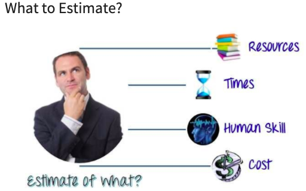

# Task Estimation 

**_Task Estimation_** is the process of estimating and predicting the total effort that’s required to complete a task and to get it to a stage where the product is ready to be deliver to the Customer. Estimations are based on assumptions and imperfect knowledge, most estimations have uncertainty. However, the objective of task estimation is to get an estimate of the time, money and number of people required to finish the defined task. 

## Steps Involved

  In an Agile environment the Epic would be broken into User Story which would then be estimated into points and assigned to a team member.  

## What to Estimate

 What to Estimate: | Explanation: 
-------------- | -------------
Resources:  | Every project need resources in order to complete the given task. These can be people, equipment, funding or anything that you need in order to complete the task defined. Must also take in the availability of these resources during the time period.
Time:  | This is the main primary resource. Within every task you are working towards a deadline. Factors such as frontend/ backend difficulty, human skills, deployment difficulty and requirement specification should be considered in order to reduce and factor time in for the unknowns when trying to accurately estimate the time for a task.
Cost:    | Projects Budget - The financial commitment necessary for completing a project successfully, after taking all factors into account. 
Human Resources:    | Factors such as the knowledge and developer experience of team members, is crucial to take into consideration while making an estimation. 

## Task Estimation Techniques 

**_Planning techniques_** are essential for Test Estimation. A template pattern can be used to guarantee requirements and other aspects of the project are met. 

**Techniques** |**for Estimation**
------------ | -------------
 **Test Point Estimation** |  In this method, we deconstruct the project into its very basic elementary components and estimate time for each of them. 
**Use-Case Point estimation:** |  Estimation on the use cases where the unadjusted actor weights and unadjusted use case weights are used to determine the software testing estimation. 
 **Functional point analysis:**    |  This method consists of assigning each functional point a weighted number based on difficulty. Ranking each from 1-5, with 1 (simple), 3 (medium), or 5 (complex).  
 **Delphi method:**    | To use this technique, you carry out surveys from QA specialists to determine an average time estimation for each task.
 
 

## The Basic Prerequisites Of The Test Estimation Process

**_Test Estimation_** is the process of finding an estimate, or approximate value, that is usable for some purpose even if input data may be incomplete, uncertain, or unstable.

**1) Insights gathered from past experience:** It is always good practice to spend some time recalling past projects which presented comparable or similar challenges to the current project you are working on.

**2) The available documents or artifacts:** The test management repository tools are very helpful in these situationa as they store many requirement and clarification documents. These documents define the scope of the project being done.

**3) Assumptions about the type of work:** Having previous experience with similar projects helps in making predictions about the project. This is why hiring experienced professionals is important.

**4) Calculation of potential risks:** The testing team also needs to prepare for the potential risks and threats which they may have to face in the future. This follows on from making assumptions about the type of work you are doing.

**5) Determining whether the documents have been baselined:** The team also needs to make a decision on if the requirements for the peoject have been baselined. If the documents are not baselined then it is crucial to determine the frequency of the changes.

**6) All responsibilities and dependencies should be clear:** The organization should clearly define the roles and responsibilities for everyone who would be performing the estimation process.

**7) Documentation and tracking of the estimation records:** All the relevant information to the estimation process should be documented.

**8) Activities which are required to be performed during the test estimation process:**
- Organize the team that would perform the estimations - best to have pervious experience
- Break the project down into project stages and ensuing essential activities. This is when a agile team will delegate story points to any activities that need to be completed.
- Compute the estimations based upon previous projects and experience of members
- Prioritize the possible threats and come up with the responces to tackle those potential risks
- Review and document the key part of the work
- Submit the work to the relevant stakeholders

# Testing Tasks
**_Testing Tasks_** Firstly involves research of the project. At this stage of the project members read through and analyse the project documentation. From doing this, it will allow the team to get a good overview of the project and discuss and resolve and questions or problems that may arise. After this plannig is done we can the move on into thee flow of testing our tasks, this is done in various ways to ensure that there is an adherent flow to the development and logic surrounding the tests that are being written.

    Testing Tasks Techniques
**1) Analysis of products:** This allows the users to understand the product that the tests are being developed for. 

Example:
- Who uses the product ?
- What problem does the product solve ?
- What gives the product value ? 
- How does the product work ?

**2) Design a test strategy:** This document is important when writing tests as it defines two main points crucial to test development, the Testing objectives and the determination off the costs and efforts needed.

**3) Define Test Objective:** is used to define the overall direction and goal for the tests, this helps keep the tests focused to the core functionality of the product.
    
    Conducting and evaluating tests
This is done when tests are being carried out, when conducting test suites, the data that you use to test is as important as the test itself, depending on the data inputted into a test it may change the expected behaviour of the test. It is also important to make sure that the test are ran in both isolation and as a suit, this will make sure that the tests written are comprehensive and cover different types of behaviors of the application.
    
    Building Test Case
When building test cases it is important to be clear and concise. This means that the test cases should be clear and to the point, the steps and all relevant data to carry out the test should also be included within the spec. The expected result from the test should also be defined in the case, as this may help other users understand the logic of the test and also identify unexpected behaviour. Assumptions and preconceptions should be included in the test case, as this will help to assist new users when establishing any preconditions required for the test.

## Resources
- https://www.softwaretestinghelp.com/agile-estimation-techniques/ 
- https://www.guru99.com/an-expert-view-on-test-estimation.html 
- https://fortegrp.com/how-to-estimate-testing-time/